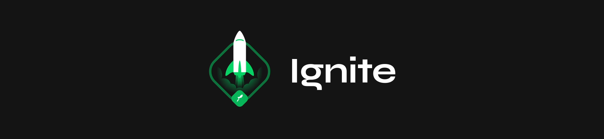

<p align="center">

</p>

Projeto desenvolvido durante o bootcamp Ignite da Rocketseat. O projeto é um blog pago, com autenticação via GitHub e pagamento via Stripe. Usuários não inscritos tem acesso apenas ao primeiro parágrafo do post.

## **:computer: TECNOLOGIAS**

  - [NextJS](https://nextjs.org/)
  - [Typescript](https://www.typescriptlang.org/)
  - [Axios](https://github.com/axios/axios)
  - [Next-Auth](https://next-auth.js.org/)
  - [Stripe](https://stripe.com/)
  - [Prismic CMS](https://prismic.io/)
  - [FaunaDB](https://fauna.com/)

## **:movie_camera: Preview**


## Como utilizar

```bash
# Clone este repositório
$ git clone https://github.com/flammajl/ignite-ignews.git ignews

# Acesse a pasta do projeto no terminal/cmd
$ cd ignews

# Crie um arquivo .env.local e coloque as variáveis
# de ambiente baseado no arquivo .env.example que
# se encontra na pasta ignews

# Instale as dependências
$ yarn install | npm install

# Execute a aplicação em modo de desenvolvimento
$ yarn dev | npm run dev

# O servidor inciará na porta:3000 - acesse <http://localhost:3000>
```

## 📝 Licença

Este projeto está licenciado sob a Licença MIT. Veja o arquivo de [LICENÇA](https://github.com/flammajl/ignite-ignews/blob/main/LICENSE) para detalhes.